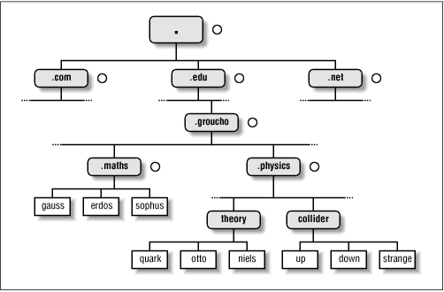

DNS
===

.. contents:: :depth: 3

Overview
--------

Notes taken from:

#. `A DNS Primer <http://danielmiessler.com/study/dns/>`_

#. `Linux Network Administrator's Guide, 2nd Edition <http://oreilly.com/catalog/linag2/book/ch06.html>`_

DNS is the Domain Name System used for obtaining IP Addresses from FQDN
(Fully Qualified Domain Names). An FQDN is an absolute name and provides
the exact location in the tree hierarchy of the domain name system. It
uniquely identifies the host worldwide.

Also note that DNS was designed to be decentralized, thus no central
authority manages all the hosts.

DNS organizes hostnames in a domain hierarchy. A domain is collection of
sites that are related in some sense (all machines in a campus,
organization, etc).

But it is more than that, given a name, it finds resources associated
with that name. This is accomplished through a distributed database
system where requests for names are handed off to various tiers of
servers which are delinieated by the dot (.). It resolves from right to
left:

#. The root domain (dot) encompases all domains. Sometimes to indicate a
   domain is fully qualified, rather than relative, it is written with a
   trailing dot, which signifies the name's last component is the root
   domain.

#. The top level domain (TLD)

#. The second level domain

#. The subdomain

#. The host/resource name

Note that organizing the namespace in a hierarchy of domain names nicely
solves the problem of name uniqueness; with DNS, a hostname has to be
unique only within its domain to give it a name different from all other
hosts worldwide.

To this end, the namespace is split up into zones, each rooted at a
domain. Note the subtle difference between a zone and a domain: the
domain groucho.edu encompasses all hosts at Groucho Marx University,
while the zone groucho.edu includes only the hosts that are managed by
the Computing Center directly; those at the Mathematics department, for
example. The hosts at the Physics department belong to a different zone,
namely physics.groucho.edu. In the above figure, the start of a zone is
marked by a small circle to the right of the domain name.

When clients make requests, they make recursive queries (rather thand
iterative queries) which lets the DNS server to do the work of getting
the answer iteratively and thus returning only the final answer to the
client.

Typical Name Resolution
-----------------------

For each zone there are at least two, or at most a few, name servers
that hold all authoritative information on hosts in that zone. Name
servers that hold all information on hosts within a zone are called
authoritative for this zone, and sometimes are referred to as master
name servers. Any query for a host within this zone will end up at one
of these master name servers.

Also, cache is very important for DNS Servers. If there were no caches,
it would be very inefficient. The data in the cache does not stay
forever though, it is configured by the admin using TTL (time to live)
configuration for the DNS Server.

When a client makes a request, the following usually happens:

#. The DNS server is configured with an initial cached (hints) of known
   addresses of root name servers. This is updated periodically in an
   authoritative way.

#. Server receives requests from client and services it using its cache
   first (usually an answer is cached from previous lookups). If not, it
   performs the following steps for client.

#. Query is made to one of root servers to find server that is
   authoritative for top-level domain being requested.

#. Answer is received that points to nameserver of the top-level domain
   resource.

#. Server *walks the tree* from right to left, sending requests from
   nameserver to nameserver, until final step which returns IP of host
   in question.

#. IP Address of requested resource is given to client.

Protocol
--------

.. code-block:: sh

                                           1  1  1  1  1  1
             0  1  2  3  4  5  6  7  8  9  0  1  2  3  4  5
            +--+--+--+--+--+--+--+--+--+--+--+--+--+--+--+--+
            |                      ID                       |
            +--+--+--+--+--+--+--+--+--+--+--+--+--+--+--+--+
            |QR|   Opcode  |AA|TC|RD|RA| Z|AD|CD|   RCODE   |
            +--+--+--+--+--+--+--+--+--+--+--+--+--+--+--+--+
            |                QDCOUNT/ZOCOUNT                |
            +--+--+--+--+--+--+--+--+--+--+--+--+--+--+--+--+
            |                ANCOUNT/PRCOUNT                |
            +--+--+--+--+--+--+--+--+--+--+--+--+--+--+--+--+
            |                NSCOUNT/UPCOUNT                |
            +--+--+--+--+--+--+--+--+--+--+--+--+--+--+--+--+
            |                    ARCOUNT                    |
            +--+--+--+--+--+--+--+--+--+--+--+--+--+--+--+--+

#. DNS protocol is quite light (12 bytes) and uses UDP so it is fast and
   much less overhead.

#. Zone Transfer and other heavy operations use TCP.

#. Fields in Protocol:

   * *Identifier*: 16-bit field containing ID so requests and responses
     and can be matched.

   * *QR Flag*: 1-bit field indicating packet is query or
     response.

   * *OP*: Specifies type of message. 0 - standard query, 1 - inverse
     query (obsolete), 2 - server status, 3 - reserve and unused, 4 -
     notification, 5 - update (Dynamic DNS).

   * *AA* - Single bit indicating authoritative answer from server who
     authoritative for that domain.

   * *TC*: Single bit for truncation. If set, usually means sent via UDP
     but was longer than 512 bytes.

   * *RD*: Single bit indicating recursion desired.

   * *RA*: Single bit reply by server indicating recursion is available.

   * *Z*: Three bits reserved and set to 0.

   * *RCode*: 4-bit field set to 0s for queries but set for responses.

     * 1 - Format error
     * 2 - Server failure
     * 3 - Name error
     * 4 - Not implemented
     * 5 - Refused
     * 6 - Name exists but shouldn't
     * 7 - Resource records exists but shouldn't
     * 8 - Resource record that should exist but doesn't
     * 9 - Response is not authoritative
     * 10 - Name is response is not within zone specified.

   * *QCount*: How many questions in question section
   
   * *ANCount*: How many answers in answer section

   * *NSCount*: How many resource records in authority section

   * *ARCount*: How many resource records in additional section

DNS Database
------------

#. DNS database does not only deal with IP Addresses of hosts but
   contains different types of entries.

#. Single piece on info from the DNS database is called a *RR (Resource
   Record)*.

#. Each record has a type associated with it describing the sort of data
   it represents, and a class specifying the type of network it applies
   to. The latter accommodates the needs of different addressing
   schemes, like IP addresses (the IN class), Hesiod addresses (used by
   MIT's Kerberos system), and a few more. The prototypical resource
   record type is the A record, which associates a fully qualified
   domain name with an IP address.

#. A host may be known by more than one name. For example you might have
   a server that provides both FTP and World Wide Web servers, which you
   give two names: *ftp.machine.org* and *www.machine.org*. However, one of
   these names must be identified as the official or canonical hostname,
   while the others are simply aliases referring to the official
   hostname. The difference is that the canonical hostname is the one
   with an associated A record, while the others only have a record of
   type CNAME that points to the canonical hostname.

Example named.hosts file for the Physics Department
^^^^^^^^^^^^^^^^^^^^^^^^^^^^^^^^^^^^^^^^^^^^^^^^^^^

.. code-block:: sh

    ; Authoritative Information on physics.groucho.edu.
    @  IN  SOA niels.physics.groucho.edu. janet.niels.physics.groucho.edu. {
                      1999090200       ; serial no
                      360000           ; refresh
                      3600             ; retry
                      3600000          ; expire
                      3600             ; default ttl
                    }
    ;
    ; Name servers
                  IN    NS       niels
                  IN    NS       gauss.maths.groucho.edu.
    gauss.maths.groucho.edu. IN A 149.76.4.23
    ;
    ; Theoretical Physics (subnet 12)
    niels         IN    A        149.76.12.1
                  IN    A        149.76.1.12
    name server   IN    CNAME    niels
    otto          IN    A        149.76.12.2
    quark         IN    A        149.76.12.4
    down          IN    A        149.76.12.5
    strange       IN    A        149.76.12.6
    ...
    ; Collider Lab. (subnet 14)
    boson         IN    A        149.76.14.1
    muon          IN    A        149.76.14.7
    bogon         IN    A        149.76.14.12
    ... 

#. The *SOA* record signals the Start of Authority, which holds general
   information and configuration on the zone the server is authoritative
   for.

#. *CNAME* always points to another name. This name then has an
   assiociated *A* record.

#. Note that all names in the sample file that do not end with a dot
   should be interpreted relative to the *physics.groucho.edu* (e.g.
   *boson*, *muon*) domain. The special name (@) used in the SOA record
   refers to the domain name by itself.

#. The name servers for the groucho.edu domain somehow have to know
   about the physics zone so that they can point queries to their name
   servers. This is usually achieved by a pair of records: the NS record
   that gives the server's FQDN, and an A record that associates an
   address with that name. Since these records are what holds the
   namespace together, they are frequently called glue records.

Reverse Lookups
---------------

#. Sometimes you need to look up the *canonical* name from an IP
   address. This is called *reverse mapping*.

#. A special domain *in-addr.arpa* has been created that contains the IP
   addresses of all hosts in a reversed dotted quad notation. For
   instance, an IP address of *149.76.12.4* corresponds to the name
   *4.12.76.149.in-addr.arpa*. The resource-record type linking these
   names to their canonical hostnames is *PTR*.

#. Note that if the address is a subnet that ends in *0* the *0* is
   ommitted in the reverse dotted quad notation. For example, subnet
   *149.76.12.0* corresponds to name *12.76.149.in-addr.arpa*.

.. code-block:: sh

    ; the 12.76.149.in-addr.arpa domain.
    @  IN  SOA  niels.physics.groucho.edu. janet.niels.physics.groucho.edu. {
                         1999090200 360000 3600 3600000 3600
               }
    2        IN     PTR       otto.physics.groucho.edu.
    4        IN     PTR       quark.physics.groucho.edu.
    5        IN     PTR       down.physics.groucho.edu.
    6        IN     PTR       strange.physics.groucho.edu.

#. in-addr.arpa system zones can only be created as supersets of IP
   networks. An even more severe restriction is that these networks'
   netmasks have to be on byte boundaries. All subnets at Groucho Marx
   University have a netmask of 255.255.255.0, hence an in-addr.arpa
   zone could be created for each subnet. However, if the netmask were
   255.255.255.128 instead, creating zones for the subnet 149.76.12.128
   would be impossible, because there's no way to tell DNS that the
   12.76.149.in-addr.arpa domain has been split into two zones of
   authority, with hostnames ranging from 1 through 127, and 128 through
   255, respectively.

DNS Caches vs. DNS Servers vs. DNS Resolvers
--------------------------------------------

#. DNS Cache is a list of names and IPs you resolved recently. The cache
   can be located in the OS level (not for Linux). Cache can be at
   browser level, router level, ISP level.

#. A DNS server can act as a cache if it is not authoritative for any
   domain. Thus, performs queries for clients and caches resolved names.

#. A DNS server can be authoritative for that domain and holds
   authoritave answers for certain resources.

#. DNS Resolvers are just clients.

   * When the client requests for recursive queries, it asks the server
     to do all the work for it and just waits for the final answer.

   * Iterative queries gets a response from server on where to look
     next. For example, if the client asks for chat.google.com, it tells
     the client to check with the .com servers and considers its work
     done.

Authoritative vs Non-authoritative Responses
--------------------------------------------

#. Authoritative responses come directly from a nameserver that has
   authority over the record in question.

#. Non-authoritave come from a second-hand server or more likely a
   cache.

Zone Tranfers
-------------

#. Uses TCP instead of UDP and during the operation, the client sends a
   query type of IXFR instead of AXFR.

#. Slave DNS servers pull records from master DNS servers.

#. Can use *dig* to perform Zone Transfer.

Anycast DNS
-----------

#. Allows for same IP to be served from multiple locations.

#. Network decides based on distance, latency, and network conditions
   which location to route to.

#. Like a CDN for your DNS.

DNS Security
------------

#. Main security issue is typing correct URL and pointed to IP of
   malicious server.

#. Easy to spoof because query and responses are UDP based.

#. DNSSEC is security oriented extensions for DNS. Main purpose is to
   ensure response comes from authorized origin.

#. Works by signing responses using public-key cryptography and uses new
   resource records.

   * *RRSIG*: DNSSEC signature for a record set. The DNS clients verify
     the signature with a public key stored in *DNSKEY* record.

   * *DNSKEY*: Contains the public key.

   * *DS*: Holds name of delegated zone.

   * *NSEC*: Contains link to next record name in zone. Used for
     validation.

   * *NSEC3*: Similar to NSEC but hashed.

   * *NSEC3PARAM*: Authoritative servers uses this which *NSEC3* records
     to use in responses.
