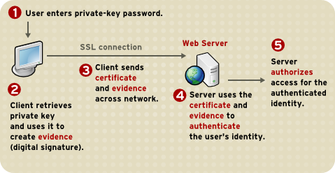

HTTP
====

.. contents:: :depth: 3

#. Hypertext Transfer Protocol. Based on RFC 822/MIME format.

#. For transferring binary it uses *base64* since HTTP is a protocol used
   to transfer text. To transfer binary it must be encoded as text and sent
   out. This is what *base64* is used for. It encodes 4 characters per 3
   bytes of data plus padding at the end. Thus, each 6 bits of input is
   encoded in a 64-character alphabet (efficiency is 4/3 = 1.333 times
   original).

#. HTTP 1.1 added persistent connections, byte ranges, content
   negotiations, and cache support.

#. Note that HTTP's protocol overhead along with connection setup
   overhead of using TCP can make HTTP a poor choice for certain
   applications. In these cases, UDP is recommended (for example DNS
   uses simple UDP requests/responses for most of the DNS queries). Can
   mitigate some of the overhead by using persistent HTTP connections.

Basic format for requests/responses:

.. code-block:: none

    message = <start-line>
              (<message-header>)*
              CRLF
              [<message-body>]
     
    <start-line> = Request-Line | Status-Line 
    <message-header> = Field-Name ':' Field-Value

*Request* format:

.. code-block:: html

    Request-Line = Method SP URI SP HTTP-Version CRLF
    Method = "OPTIONS"
           | "HEAD"  
           | "GET"  
           | "POST"  
           | "PUT"  
           | "DELETE"  
           | "TRACE"

.. code-block:: html

    GET /articles/http-basics HTTP/1.1
    Host: www.articles.com
    Connection: keep-alive
    Cache-Control: no-cache
    Pragma: no-cache
    Accept: text/html,application/xhtml+xml,application/xml;q=0.9,*/*;q=0.8

*Response* format:

.. code-block:: html

    Status-Line = HTTP-Version SP Status-Code SP Reason-Phrase CRLF

.. code-block:: html

    HTTP/1.1 200 OK
    Server: nginx/1.6.1
    Date: Tue, 02 Sep 2014 04:38:20 GMT
    Content-Type: text/html
    Last-Modified: Tue, 05 Aug 2014 11:18:35 GMT
    Transfer-Encoding: chunked
    Connection: keep-alive
    Content-Encoding: gzip

Codes
-----

*Summary:*

  ====  =====================
  Code  Classification
  ====  =====================
  1xx   Informational
  100   Continue
  ----  ---------------------
  2xx   Success
  200   OK
  ----  ---------------------
  3xx   Redirection
  301   Moved Permanently
  302   Found
  ----  ---------------------
  4xx   Client Error
  401   Unauthorized
  403   Forbidden
  404   Not Found
  ----  ---------------------
  5xx   Server Error
  500   Internal Server Error
  ====  =====================

Examples
^^^^^^^^

**Code 301 Redirection**

An example of this is when requesting a certain snapshot from the debian
archives. Let's request for a date *(January 02, 2012 22:05:11) 20120102T220511Z*:

.. code-block:: none

    $ http --headers get http://snapshot.debian.org/archive/debian/20120102T220511Z/pool/main/b/bash/
    HTTP/1.1 301 Moved Permanently
    Accept-Ranges: bytes
    Age: 0
    Cache-Control: public, max-age=600
    Connection: keep-alive
    Content-Encoding: gzip
    Content-Length: 224
    Content-Type: text/html; charset=UTF-8
    Date: Wed, 01 Oct 2014 18:36:27 GMT
    Expires: Wed, 01 Oct 2014 18:46:26 GMT
    Location: http://snapshot.debian.org/archive/debian/20120102T214803Z/pool/main/b/bash/
    Server: Apache
    Vary: Accept-Encoding
    Via: 1.1 varnish
    X-Varnish: 1485917301

Notice that we get back a *301* code that stands for redirection. We
then get redirected to *http://snapshot.debian.org/archive/debian/20120102T214803Z/pool/main/b/bash/*.

**Code 302 Found**

Indicates resource resides temporarily under a different URI (`10.3.3 302 Found <http://www.w3.org/Protocols/rfc2616/rfc2616-sec10.html#sec10.3.3>`_).

.. code-block:: none

    $ http get amits-notes.readthedocs.org
      HTTP/1.1 302 FOUND
      Connection: keep-alive
      Content-Language: en
      Content-Length: 0
      Content-Type: text/html; charset=utf-8
      Date: Tue, 14 Oct 2014 18:37:30 GMT
      Location: http://amits-notes.readthedocs.org/en/latest/
      Server: nginx/1.4.6 (Ubuntu)
      Vary: Accept-Language, Cookie
      X-Deity: chimera-lts
      X-Fallback: True

Methods
-------

GET
^^^

Fetch a resource. Example in python:

.. code-block:: python

    def get():
    # Simple GET of index.html
    headers = { 'User-Agent': 'http_client/0.1',
                'Accept': '*/*',
                'Accept-Encoding': 'gzip, deflate' }
    http_conn = http.client.HTTPConnection("localhost")
    http_conn.set_debuglevel(1)
    http_conn.request("GET", "/", headers=headers)

    ## Response
    resp = http_conn.getresponse()
    print()
    print("Status:", resp.status, resp.reason)

    ## Cleanup
    http_conn.close()

Persistent Connections
----------------------

#. Uses *Connection: keep-alive* header request/response header.

#. Idea is to use single TCP connection to send and receive multiple
   HTTP Requests/Responses. Thus, avoiding expensive TCP handshake.

#. This is default in HTTP/1.1.

#. Disadvantages when single documents are repeatedly requested (e.g.
   images). This kills performance due to keeping unnecessary
   connections open for many seconds after document was retrieved.

#. When you set up a TCP connection, you associate a set of timers.
   Some of the timers are used for keepalive.

#. A Keepalive probe is a packet with no data and ACK flag turned on.

   * Note that in TCP/IP RFC, ACK segments with no data are not reliably
     transmitted by TCP. Thus, no retries.

   * Remote host doesn't need to support keepalive. It will see an ACK
     packet and send back an ACK reply.

#. Since TCP/IP is a stream oriented protocol, a zero length data packet
   is not dangerous for user program.

#. If no reply packets are received for keepalive probe, can assume that
   connection is broken.

#. Also useful when NAT terminates connection since it only can keep
   track of certain number of connections at a time.

#. Useful to know if peers have died before notifying you (e.g. kernel
   panic, reboot).

.. code-block:: none

     _____                                                     _____
    |     |                                                   |     |
    |  A  |                                                   |  B  |
    |_____|                                                   |_____|
       ^                                                         ^
       |--->--->--->-------------- SYN -------------->--->--->---|
       |---<---<---<------------ SYN/ACK ------------<---<---<---|
       |--->--->--->-------------- ACK -------------->--->--->---|
       |                                                         |
       |                                       system crash ---> X
       |
       |                                     system restart ---> ^
       |                                                         |
       |--->--->--->-------------- PSH -------------->--->--->---|
       |---<---<---<-------------- RST --------------<---<---<---|
       |                                                         |

References:

#. `TCP Keepalive HOWTO <http://tldp.org/HOWTO/TCP-Keepalive-HOWTO/overview.html>`_

#. `Wikipedia - HTTP Persistent Connection <http://en.wikipedia.org/wiki/HTTP_persistent_connection>`_

#. `RFC 1122 Section 4.2.3.6 - TCP Keep-Alives <http://tools.ietf.org/html/rfc1122#page-101>`_

keepalive in Linux
^^^^^^^^^^^^^^^^^^

Default is two hours before starting to send keepalive packets:

.. code-block:: none

    # cat /proc/sys/net/ipv4/tcp_keepalive_time
    7200

    # cat /proc/sys/net/ipv4/tcp_keepalive_intvl
    75

    # cat /proc/sys/net/ipv4/tcp_keepalive_probes
    9
 
To add support to your application use *setsockopt()* and configure the socket
connection for keepalive. 

Can also use `libkeepalive <http://libkeepalive.sourceforge.net/>`_ with
*LD_PRELOAD* to add support to any C application.

Document Caching
----------------

From: `Google Browser Security Handbook, Part 2 <https://code.google.com/p/browsersec/wiki/Part2#Document_caching>`_

#. HTTP requests are expensive mainly because of overhead of setting up
   TCP connections. Thus, important to have the browser or intermediate
   system (proxy) maintain local copy of some of the data.

#. The HTTP/1.0 spec did define some headers to handle caching but it
   did not provide any specific guidance.

   * *Expires*: This is a response header that allows server to declare
     an expiration date. When this date is passed, browsers must
     retrieve new document. There is a *Date* header as well which
     defines the date and time which message was originated. Sometimes,
     however, *Date* header is not part of response. Thus,
     implementation is then browser specific.

     The RFC also does not specify if the *Expires* is based on
     browser's local clock. Thus, current practice is to compute
     *Expires-Date* delta and compare it to browser clock.

   * *Pragma* request header when set to *no-cache* permits clients to
     override intermediate systems to re-issue requests rather than
     retrieve cached data. For *Pragma* response header, it instructs
     browser not to cache this data.

   * *Last-Modified* response header indicates when resource was last
     updated according to server's local clock. Reflects modification
     date of file system. Used in conjunction with *If-Modified-Since*
     request header to revalidate cache entries.

   * *If-Modified-Since* request header, permitting client to indicate
     what *Last-Modified* header it had seen on the version of the
     document already present in browser or proxy cache. If server
     calculates that no modification since *If-Modified-Since* date it
     returns *304 Not Modified* response instead of requested document.
     Thus, client will redisplay cached content.

   * All of above was useful when content was static. Thus, with complex
     dynamic web apps, most developers turned off caching.

#. HTTP/1.1 acknowledges the issue and establishes ground rules for what
   and when should be cached.

   * Only 200 (*OK*), 203 (*Non-Authoritative*), 206 (*Partial
     Content*), 300 (*Multple Choices*), and 301 (*Redirection*)
     responses are cacheable, and only if the method is not POST, PUT,
     DELETE, or TRACE.

   * *Cache-Control* header introduced that provides a fine-grained
     control over caching strategies.

     * *no-cache* disables cache all together. Can disable cache for
       certain specific headers as well (e.g. *no-cache: Set-Cookie*).

       * Firefox still stores responses because of back and forward
         navigation between sessions. But it doesn't do this on *https*
         connections because of sensitive information such as banking,
         etc.

     * *no-store*: If in request don't store any request response in
       cache. If sent in response, client must not store anything from
       request/response headers.

     * *public/private*: Controls caching on intermediate systems.

     * *max-age*: Time to live in seconds.

Authentication
--------------

Basic Auth
^^^^^^^^^^

This is the simplest form of authentication since it doesn't require
cookies, session identifier or login pages. It uses standard HTTP
*Authorization* header to send login credentials. Thus, no handshakes
need to be done.

Typically used over *https* since encoding is done in *base64*
(passwords sent as plain text). Passwords can be easily decoded.

On *Server*, status code 401 is sent back and the following header is used:

.. code-block:: none

    WWW-Authenticate: Basic realm="Restricted"

On *Client*, the *Authorization* header is used with the following
format:

.. code-block:: none

    Authorization: Basic base64("username:password")

Example in python:

.. code-block:: python

    def get_auth():
    # GET with authorization of index.html
    authstring = base64.b64encode(("%s:%s" % ("amit","amit")).encode())
    authheader = "Basic %s" % (authstring.decode())
    print("Authorization: %s" % authheader)

    headers = { 'User-Agent': 'http_client/0.1',
                'Accept': '*/*',
                'Authorization': authheader,
                'Accept-Encoding': 'gzip, deflate' }
    http_conn = http.client.HTTPConnection("localhost")
    http_conn.set_debuglevel(1)
    http_conn.request("GET", "/", headers=headers)

    ## Response
    resp = http_conn.getresponse()
    print()
    print("Status:", resp.status, resp.reason)

    ## Cleanup
    http_conn.close()

Digest
^^^^^^

Basically uses MD5 of password and *nonce* value to prevent replay
attacks. Now, pretty much replaced by HMAC (keyed-hash message
authentication code).

A basic digest authentication session goes as follows:

#. HTTP client performs a request (GET, POST, PUT, etc)

#. HTTP server responds with a 401 error not authorized. In the
   response, a *WWW-Authenticate* header is sent that contains:

   * *Digest algorithm* - Usually *MD5*.
   * *realm* - The access realm. A string identifying the realm of the server.
   * *qop* - Stands for quality of protection (e.g. *auth*)
   * *nonce* - Server generated hash, issued only once per *401*
     response. Server should also have a timeout for the nonce values.

#. Client then receives the 401 status error and parses the header so it
   knows how to authenticate itself. It responds with the usual header
   and adds an *Authorization* header containing:

   * *Digest username*
   * *realm*
   * *nonce* - Sends the server generated value back.
   * *uri* - Sends the path to the resource it is requesting.
   * *algorithm* - The algorithm the client used to compute the hashes.
   * *qop*
   * *nc* - hexadecimal counter for number of requests.
   * *cnonce* - client generated nonce, always is generated per request.
   * *response* - Computed hash of ``md5(HA1:nonce:nc:cnonce:qop:HA2)``.

     * HA1 = ``md5(username:realm:password)``
     * HA2 = ``md5(<request method.:uri)``

   Notice how the client does not send the password in plain text.

#. Server computes hash and compares to client's hash and if it matches
   sends back *OK* with content. Note that *rspauth* sent back by server
   is a mutual authentication proving to client it knows its secret.

#. *Note* that each client needs to know the password and the password
   needs to be shared securely before hand.

**Example HTTP Capture:**

.. code-block:: none

    C:
    GET /files/ HTTP/1.1
    Host: localhost
    User-Agent: http_client/0.1
    Accept-Encoding: gzip, deflate
    Accept: */*

    S:
    HTTP/1.1 401 Unauthorized
    Server: nginx/1.6.1
    Date: Sat, 06 Sep 2014 02:09:24 GMT
    Content-Type: text/html
    Content-Length: 194
    Connection: keep-alive
    WWW-Authenticate: Digest algorithm="MD5", qop="auth", realm="Access Restricted", nonce="2a27b9b6540a6cd4"

    C:
    GET /files/ HTTP/1.1
    Host: localhost
    User-Agent: http_client/0.1
    Accept-Encoding: gzip, deflate
    Accept: */*
    Authorization: Digest username="amit", realm="Access Restricted", nonce="2a27b9b6540a6cd4", uri="/files/",
    response="421974c0c2805413b0d4187b9b143ecb", algorithm="MD5", qop="auth", nc=00000001, cnonce="e08190d5"

    S:
    HTTP/1.1 200 OK
    Server: nginx/1.6.1
    Date: Sat, 06 Sep 2014 02:09:24 GMT
    Content-Type: text/html
    Transfer-Encoding: chunked
    Connection: keep-alive
    Authentication-Info: qop="auth", rspauth="33fea6914ddcc2a25b03aaef5d6b478b", cnonce="e08190d5", nc=00000001..
    Content-Encoding: gzip

**Example Python Code:**

.. code-block:: python

    def get_auth_digest():
        resp = get()

        # Get dictionary of headers
        headers = resp.getheader('WWW-Authenticate')
        h_list = [h.strip(' ') for h in headers.split(',')]
        #h_tuple = re.findall("(?P<name>.*?)=(?P<value>.*?)(?:,\s)", headers) 
        h_tuple = [tuple(h.split('=')) for h in h_list]
        f = lambda x: x.strip('"')
        h = {k:f(v) for k,v in h_tuple}
        print(h)

        # HA1 = md5(username:realm:password)
        ha1_str = "%s:%s:%s" % ("amit",h['realm'],"amit")
        ha1 = hashlib.md5(ha1_str.encode()).hexdigest()
        print("ha1:",ha1)

        # HA2 = md5(GET:uri) i.e. md5(GET:/files/)
        ha2_str = "%s:%s" % ('GET',path)
        ha2 = hashlib.md5(ha2_str.encode()).hexdigest()
        print("ha2:",ha2)

        # Generate cnonce
        cnonce = hashlib.sha1(str(random.random()).encode()).hexdigest()[:8]
        print("cnonce:",cnonce)

        # Generate response = md5(HA1:nonce:00000001:cnonce:qop:HA2)
        resp_str = "%s:%s:%s:%s:%s:%s" % (ha1,h['nonce'],"00000001",cnonce,h['qop'],ha2)
        resp_hash = hashlib.md5(resp_str.encode()).hexdigest()
        print("resp_hash:",resp_hash)

        # Do another get
        authheader = 'Digest username="%s", realm="%s", nonce="%s", ' \
                     'uri="%s", response="%s", algorithm="%s", qop="%s", nc=00000001, ' \
                     'cnonce="%s"' \
                     % ("amit", h['realm'], h['nonce'], path, resp_hash, h['Digest algorithm'], h['qop'], cnonce)
        print(authheader)
        headers = { 'User-Agent': 'http_client/0.1',
                    'Accept': '*/*',
                    'Accept-Encoding': 'gzip, deflate',
                    'Authorization': authheader
                  }
        get(headers)

Cookie Based
^^^^^^^^^^^^

Cookies are designed to maintain state. Thus, cookie based
authentication inherits this stateful principle. Cookie authentication
are the most common method used by web servers to know if the user is
still logged in or not. The browser keeps sending back the same cookie
to the server in every request.

Browser uses **Set-Cookie** header to ask client to store the cookie.
The client uses **Cookie** header to send back the cookie to the server
so the server knows which client it is talking to.

Cookies are incompatible with *REST* style/architecture since *REST* is
stateless. According to *REST* style, cookies maintain site-wide state
while *REST* styles maintains application state. In *REST*, cookie
functionality can be achieved using anonymous authentication and
client-side state. *REST* also defines an alternative to cookies when
implementing shopping carts. According to *REST*:

*Likewise, the use of cookies to identify a user-specific "shopping
basket" within a server-side database could be more efficiently
implemented by defining the semantics of shopping items within the
hypermedia data formats, allowing the user agent to select and store
those items within their own client-side shopping basket, complete with
a URI to be used for check-out when the client is ready to purchase.*

Cookies have certain rules and attributes:

#. Name/value pair can't contain spaces or `; =`. Usually only ASCII
   characters. The `;` is used as a delimiter.

#. The *Secure* attribute means this cookie is only used in encrypted
   communications.

#. The *HttpOnly* attribute means this cookie can only be used by
   http/https requests and not by JavaScript, etc. This prevents cross
   site scripting.

Other notes:

#. Not good practice to store username/password in cookies, even if it
   is hashed/salted, etc. Can be stolen and eventually cracked.

#. Cookie based authentication basically involves using the cookie the
   server sent to the client back to the server for every request.

Certificate Based
^^^^^^^^^^^^^^^^^

Idea is to separate those who verify password (the server will have a
copy or a hash of the password) and those who define the user identity.
Thus, certificate authority (CA) issues a private certificate to a user, and
guarantees that it can communicate using this key with the public key
issued to the other business party.

Note that the downside becomes apparent when large number of clients or
users need to authenticate to the server. Thus, CA needs to issue
certificate for each user. These certificates needs to be verified and
if one user is compromised the certificate of that user can be used to
authenticate to the server unless the certificate is revoked.

For the reasons stated above, client authentication is rarely used with
TLS. A common technique is to use TLS to authenticate the server to the
client and to establish a private channel, and for the client to
authenticate to the server using some other means - for example, a
username and password using HTTP basic or digest authentication.

The above image depicts certificate-based authentication. The client
asks the user to enter a password which unlocks the database holding the
private key. The client then uses this private key to sign a random data
and sends a certificate to the server. Thus, the password is never sent.

The `Red Hat Portal <https://access.redhat.com/documentation/en-US/Red_Hat_Certificate_System/8.0/html/Deployment_Guide/Introduction_to_Public_Key_Cryptography-Certificates_and_Authentication.html>`_ discusses this in great detail.

nginx `engineX`
---------------

Permissions
^^^^^^^^^^^

Make sure the permissions of the files in the directory are accessible
to the `other` group. Or change the permissions to the user that `nginx`
runs as (for debian it's `www-data`).

Setting up Basic Auth
^^^^^^^^^^^^^^^^^^^^^

1. Install **apache2-utils** to get **htpasswd**
2. Create an **.htpasswd** file in the web root. Make sure the
   permissions are *644*. Note that the password generated by *htpasswd*
   is an apache modified version of MD5.

.. code-block:: bash

    sudo htpasswd -c /usr/share/nginx/html/.htpasswd amit

3. Update */etc/nginx/sites-available/default* in the location */* and
   reload *nginx*:

.. code-block:: none

    # Basic auth
    auth_basic "Restricted";
    auth_basic_user_file /etc/nginx/.htpasswd;

Setting up Digest Auth
^^^^^^^^^^^^^^^^^^^^^^

1. **apache2-utils** includes **htdigest** (similar to *htpasswd*) to
   generate digest key.
2. Create an **.htdigest** file in the web root. Make sure the
   permissions are *644*. Note that the *realm* here is *"Access
   Restricted"*.

.. code-block:: bash

    sudo htdigest -c /usr/share/nginx/html/.htdigest "Access Restricted" amit

3. Need to build with *nginx-http-auth-digest* module from
   https://github.com/rains31/nginx-http-auth-digest. In order to do
   this, download *nginx* debian sources, copy *nginx-http-auth-digest*
   to *debian/modules*, and finally edit *debian/rules* to build
   *nginx-http-auth-digest* (look at *--add-module* config option).

4. Update */etc/nginx/sites-available/default* in the location */* and
   reload *nginx*:

.. code-block:: none

    # Digest auth
    auth_digest "Access Restricted";    # Realm
    auth_digest_user_file /usr/share/nginx/html/.htdigest;

Others
------

HTTPie - Command Line HTTP Client
^^^^^^^^^^^^^^^^^^^^^^^^^^^^^^^^^

Very useful and feature rich command line http client written in Python
(http://github.com/jakubroztocil/httpie).

Useful for debugging HTTP requests. For example:

.. code-block:: none

    $ http get http://localhost
    HTTP/1.1 200 OK
    Connection: keep-alive
    Content-Encoding: gzip
    Content-Type: text/html
    Date: Mon, 01 Sep 2014 18:31:03 GMT
    Last-Modified: Tue, 05 Aug 2014 11:18:35 GMT
    Server: nginx/1.6.1
    Transfer-Encoding: chunked
    
    <!DOCTYPE html>
    <html>
    <head>
    <title>Welcome to nginx!</title>
    
    </head>
    <body>
    <h1>Welcome to nginx!</h1>
    
If you see this page, the nginx web server is successfully installed and
    working. Further configuration is required.

    
    
For online documentation and support please refer to
    <a href="http://nginx.org/">nginx.org</a>. 
    Commercial support is available at
    <a href="http://nginx.com/">nginx.com</a>.

    
    
<em>Thank you for using nginx.</em>

    </body>
    </html>
