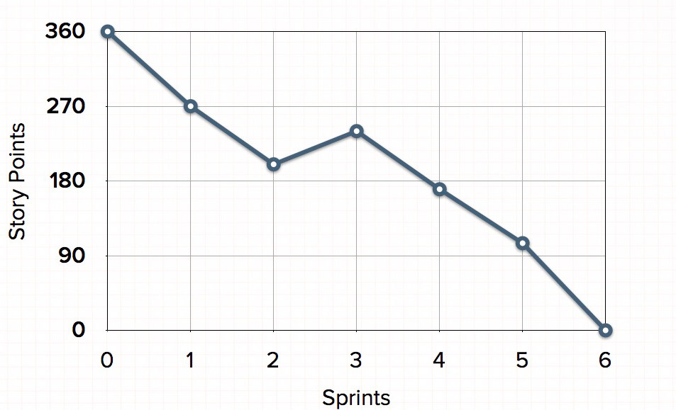
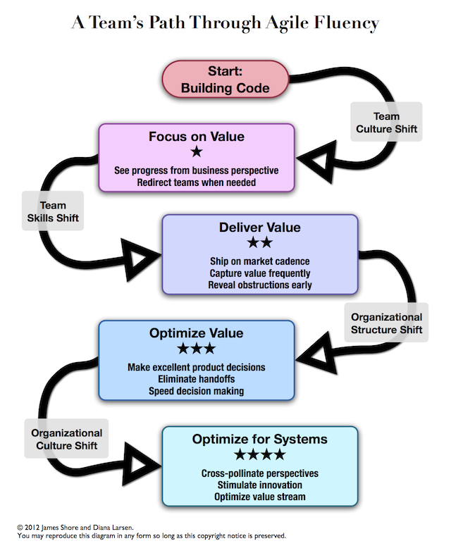

Project Management
==================

.. contents:: :depth: 4

Agile
-----

Notes from: http://martinfowler.com/articles/newMethodology.html

#. Agile is a compromise between no process and too much process,
   providing just enough process to gain a reasonable payoff.

#. *Agile methods are adaptive rather than predictive.* Engineering
   methods tend to try to plan out a large part of the software process
   in great detail for a long span of time, this works well until things
   change. So their nature is to resist change. The agile methods,
   however, welcome change. They try to be processes that adapt and
   thrive on change, even to the point of changing themselves.

#. *Agile methods are people-oriented rather than process-oriented.* The
   goal of engineering methods is to define a process that will work
   well whoever happens to be using it. Agile methods assert that no
   process will ever make up the skill of the development team, so the
   role of a process is to support the development team in their work.

Predictive vs Adaptive
^^^^^^^^^^^^^^^^^^^^^^

#. The usual inspiration for methodologies is engineering disciplines
   such as civil or mechanical engineering. Such disciplines put a lot
   of emphasis on planning before you build.

#. So what we see here are two fundamentally different activities.
   Design which is difficult to predict and requires expensive and
   creative people, and construction which is easier to predict. Once we
   have the design, we can plan the construction.

#. So the approach for software engineering methodologies looks like
   this: we want a predictable schedule that can use people with lower
   skills. To do this we must separate design from construction.

#. This is where design notations such as UML come into play. If we can
   make all the significant decisions using the UML, we can build a
   construction plan and then hand these designs off to coders as a
   construction activity.

#. For Engineering designs, mathematical analysis can show if a design
   will work. However, for UML it is only through peer-review that
   design can be checked.

#. For a bridge, cost of design is only about 10% of job, rest is
   construction. For code it is the opposite, apparently only 15% of
   project is code and unit tests.

#. Thus, source code is the design document and construction is the
   compiler/linker. Thus, the construction phase is cheap and and should
   be automated.

#. Conclusions:

   * In software: construction is so cheap as to be free
   * In software all the effort is design, and thus requires creative
     and talented people (source code)
   * Creative processes are not easily planned, and so predictability
     may well be an impossible target.
   * We should be very wary of the traditional engineering metaphor for
     building software. It's a different kind of activity and requires a
     different process.

The Unpredictability of Requirements
~~~~~~~~~~~~~~~~~~~~~~~~~~~~~~~~~~~~

#. Developers shouldn't be surprised that the requirements are always
   changing. This is the norm in software.

#. One problem with this is that just trying to understand the options
   for requirements is tough.

#. Estimation is hard for many reasons. Part of it is that software
   development is a design activity, and thus hard to plan and cost.
   Part of it is that the basic materials keep changing rapidly. Part of
   it is that so much depends on which individual people are involved,
   and individuals are hard to predict and quantify.

#. It's very difficult to see what value a software feature has until
   you use it for real. Only when you use an early version of some
   software do you really begin to understand what features are valuable
   and what parts are not.

#. In today's economy the fundamental business forces are changing the
   value of software features too rapidly.

#. Predictability is not impossible. NASA's space shuttle software group
   are prime example of predictability. But they have huge resources,
   lots of time, and very stable requirements. But most software
   projects are not similar to this.

#. However letting go of predictability doesn't mean you have to revert
   to uncontrollable chaos. Instead you need a process that can give you
   control over an unpredictability. That's what adaptivity is all
   about.

Controlling an Unpredictable Process - Iterations
~~~~~~~~~~~~~~~~~~~~~~~~~~~~~~~~~~~~~~~~~~~~~~~~~

#. To get some form of predictability, we need an accurate way of
   knowing where we are at this point. This is where feedback mechanisms
   and feedback loops come into play. We need to learn about ourselves
   (the software, team, etc).

#. This is what iterative development is all about.

#. The key to iterative development is to frequently produce working
   versions of the final system that have a subset of the required
   features. These working systems are short on functionality, but
   should otherwise be faithful to the demands of the final system. They
   should be fully integrated and as carefully tested as a final
   delivery.

#. The point of this is that there is nothing like a tested, integrated
   system for bringing a forceful dose of reality into any project.
   Documents can hide all sorts of flaws. Untested code can hide plenty
   of flaws. But when people actually sit in front of a system and work
   with it, then flaws become truly apparent: both in terms of bugs and
   in terms of misunderstood requirements.

#. Iterative development makes sense in predictable processes as well.
   But it is essential in adaptive processes because an adaptive process
   needs to be able to deal with changes in required features.

#. This leads to a style of planning where long term plans are very
   fluid, and the only stable plans are short term plans that are made
   for a single iteration. Iterative development gives you a firm
   foundation in each iteration that you can base your later plans
   around.

#. A key question for this is how long an iteration should be. Different
   people give different answers. XP suggests iterations of one or two
   weeks. SCRUM suggests a length of a month. Crystal may stretch
   further. The tendency, however, is to make each iteration as short as
   you can get away with. This provides more frequent feedback, so you
   know where you are more often.

The Adaptive Customer
~~~~~~~~~~~~~~~~~~~~~

#. This kind of adaptive process requires a different kind of
   relationship with a customer than the ones that are often considered.

#. A fixed price contract requires stable requirements and hence a
   predictive process. Adaptive processes and unstable requirements
   imply you cannot work with the usual notion of fixed-price.

#. After all the customer wouldn't be wanting some software unless their
   business needed it. If they don't get it their business suffers. So
   even if they pay the development company nothing, they still lose.
   Indeed they lose more than they would pay for the software (why would
   they pay for the software if the business value of that software were
   less?)

#. This doesn't mean that you can't fix a budget for software up-front.
   What it does mean is that you cannot fix time, price and scope. **The
   usual agile approach is to fix time and price, and to allow the scope
   to vary in a controlled manner.**

#. In an adaptive process the customer has much finer-grained control
   over the software development process. At every iteration they get
   both to check progress and to alter the direction of the software
   development. This leads to much closer relationship with the software
   developers, a true business partnership.

#. All this yields a number of advantages for the customer. For a start
   they get much more responsive software development. A usable,
   although minimal, system can go into production early on. The
   customer can then change its capabilities according to changes in the
   business, and also from learning from how the system is used in
   reality.

#. Every bit as important as this is greater visibility into the true
   state of the project.

#. If bad news is lurking it tends to come earlier, when there is still
   time to do something about it. Indeed this risk control is a key
   advantage of iterative development.

#. Mary Poppendieck summed up this difference in viewpoint best for me
   with her phrase *"A late change in requirements is a competitive
   advantage".*  Often the most valuable features aren't at all obvious
   until customer have had a chance to play with the software. Agile
   methods seek to take advantage of this, encouraging business people
   to learn about their needs as the system gets built, and to build the
   system in such a way that changes can be incorporated quickly.

#. All this has an important bearing what constitutes a successful
   project. A predictive project is often measured by how well it met
   its plan. A project that's on-time and on-cost is considered to be a
   success.

#. This measurement is nonsense to an agile environment. For agilists
   the question is business value - did the customer get software that's
   more valuable to them than the cost put into it.

#. A good predictive project will go according to plan, a good agile
   project will build something different and better than the original
   plan foresaw.

Putting People First
^^^^^^^^^^^^^^^^^^^^

#. Executing an adaptive process is not easy. In particular it requires
   a very effective team of developers. The team needs to be effective
   both in the quality of the individuals, and in the way the team
   blends together.

Plug-Compatible Programming Units
~~~~~~~~~~~~~~~~~~~~~~~~~~~~~~~~~

#. One of the aims of traditional methodologies is to develop a process
   where the people involved are replaceable parts. With such a process
   you can treat people as resources who are available in various types.
   You have an analyst, some coders, some testers, a manager. The
   individuals aren't so important, only the roles are important.

#. But this raises a key question: are the people involved in software
   development replaceable parts? One of the key features of agile
   methods is that they reject this assumption.

#. Furthermore his (Alastair Cockburn) studies of software projects have
   led him to conclude the people are the most important factor in
   software development.

#. "People" are highly variable and non-linear, with unique success
   and failure modes. Those factors are first-order, not negligible
   factors.

#. This creates a strong positive feedback effect. If you expect all
   your developers to be plug-compatible programming units, you don't
   try to treat them as individuals. This lowers morale (and
   productivity).

#. The notion of people as resources is deeply ingrained in business
   thinking, its roots going back to the impact of Frederick Taylor's
   Scientific Management approach. In running a factory, this Taylorist
   approach may make sense. But for the highly creative and professional
   work, which I believe software development to be, this does not hold.

Programmers are Responsible Professionals
~~~~~~~~~~~~~~~~~~~~~~~~~~~~~~~~~~~~~~~~~

#. A key part of the Taylorist notion is that the people doing the work
   are not the people who can best figure out how best to do that work.

#. Recent history increasingly shows us how untrue this is for software
   development. Increasingly bright and capable people are attracted to
   software development, attracted by both its glitz and by potentially
   large rewards.

#. When you want to hire and retain good people, you have to recognize
   that they are competent professionals. As such they are the best
   people to decide how to conduct their technical work.

Managing a People Oriented Process
~~~~~~~~~~~~~~~~~~~~~~~~~~~~~~~~~~

#. It is about accepting the process not being forced to follow the
   process by management. Thus, requires active involvement of team.

#. Another point is that the developers must be able to make all
   technical decisions. XP gets to the heart of this where in its
   planning process it states that only developers may make estimates on
   how much time it will take to do some work.

#. Such an approach requires a sharing of responsibility where
   developers and management have an equal place in the leadership of
   the project. Notice that I say equal. Management still plays a role,
   but recognizes the expertise of developers.

#. An important reason for this is the rate of change of technology in
   our industry. After a few years technical knowledge becomes obsolete.
   This half life of technical skills is without parallel in any other
   industry. Even technical people have to recognize that entering
   management means their technical skills will wither rapidly.
   Ex-developers need to recognize that their technical skills will
   rapidly disappear and they need to trust and rely on current
   developers.

The Difficulty of Measurement
~~~~~~~~~~~~~~~~~~~~~~~~~~~~~

#. Despite our best efforts we are unable to measure the most simple
   things about software, such as productivity. Without good measures
   for these things, any kind of external control is doomed.

#. The point of all this is that traditional methods have operated under
   the assumption that measurement-based management is the most
   efficient way of managing. The agile community recognizes that the
   characteristics of software development are such that measurement
   based management leads to very high levels of measurement
   dysfunction. It's actually more efficient to use a delegatory style
   of management, which is the kind of approach that is at the center of
   the agilist viewpoint.

The Role of Business Leadership
~~~~~~~~~~~~~~~~~~~~~~~~~~~~~~~

#. This leads to another important aspect of adaptive processes: they
   (developers) need very close contact with business expertise.

#. This goes beyond most projects involvement of the business role.
   Agile teams cannot exist with occasional communication . They need
   continuous access to business expertise. Furthermore this access is
   not something that is handled at a management level, it is something
   that is present for every developer.

#. A large part of this, of course, is due to the nature of adaptive
   development. Since the whole premise of adaptive development is that
   things change quickly, you need constant contact to advise everybody
   of the changes.

The Self-Adaptive Process
^^^^^^^^^^^^^^^^^^^^^^^^^

#. However there's another angle to adaptivity: that of the process
   changing over time. A project that begins using an adaptive process
   won't have the same process a year later. Over time, the team will
   find what works for them, and alter the process to fit.

#. The first part of self-adaptivity is regular reviews of the process.
   Usually you do these with every iteration. At the end of each
   iteration, have a short meeting and ask yourself the following
   questions (culled from Norm Kerth)

      * What did we do well?
      * What have we learned?
      * What can we do better?
      * What puzzles us?

#. While both published processes and the experience of other projects
   can act as an inspiration and a baseline, the developers professional
   responsibility is to adapt the process to the task at hand.

Flavors of Agile Development
^^^^^^^^^^^^^^^^^^^^^^^^^^^^

Agile Manifesto
~~~~~~~~~~~~~~~

#. Started in 2001 where bunch of people met and came up with
   *Manifestor for Agile Development*.

#. There were other groups coming with similar approaches to iterative
   development. No common name for all these approaches but
   *lightweight* was being used a lot.

#. Decision was to use *agile* as the umbrella name.

#. No formal organization but there is an *Agile Alliance*.  This group
   is a non-profit group intended to promote and research agile methods.
   Amongst other things it sponsors an annual conference in the US.

XP (Extreme Programming)
~~~~~~~~~~~~~~~~~~~~~~~~

#. Got the lion's share of attention early in the agile movement.

#. The roots of XP lie in the Smalltalk community, and in particular the
   close collaboration of Kent Beck and Ward Cunningham in the late
   1980's. Both of them refined their practices on numerous projects
   during the early 90's, extending their ideas of a software
   development approach that was both adaptive and people-oriented.

#. XP begins with five values (Communication, Feedback, Simplicity,
   Courage, and Respect). It then elaborates these into fourteen
   principles and again into twenty-four practices. The idea is that
   practices are concrete things that a team can do day-to-day, while
   values are the fundamental knowledge and understanding that underpins
   the approach.

#. XP has strong emphasis on testing. XP puts testing at the foundation
   of development, with every programmer writing tests as they write
   their production code. The tests are integrated into a continuous
   integration and build process which yields a highly stable platform
   for future development. XP's approach here, often described under the
   heading of Test Driven Development (TDD) has been influential even in
   places that haven't adopted much else of XP.

Scrum
~~~~~

*Scrum (n): A framework within which people can address complex adaptive
problems, while productively and creatively delivering products of the
highest possible value.*

#. Scrum also developed in the 80's and 90's primarily with OO
   development circles as a highly iterative development methodology.
   It's most well known developers were Ken Schwaber, Jeff Sutherland,
   and Mike Beedle.

#. Scrum concentrates on the management aspects of software development,
   dividing development into thirty day iterations (called 'sprints')
   and applying closer monitoring and control with daily scrum meetings.
   It places much less emphasis on engineering practices and **many people
   combine its project management approach with extreme programming's
   engineering practices.** (XP's management practices aren't really very
   different.)

#. Asserts that knowledge comes from experience and making decisions
   based on what is known. Scrum employs an iterative, incremental
   approach to optimize predictability and control risk. 

#. Scrum Events:

   * All events are timeboxed for duration.

   * A formal opportunity to inspect and adapt something.

   * Sprint is heart of scrum. Timeboxed one month or less (if *sprint
     goal* is accomplished early).

       * Sprint Planning

           * Timeboxed to a max of eight hours. Answers what can be
             delivered at the end of sprint? And how this work will be
             achieved.

           * Dev team discusses forecasts of functionality that will be
             implemented. Product Owner discusses objective of sprint.

           * Performance of past sprints is also reviewed. Number of
             items selected from backlog is solely up to dev team.

           * Sprint Goal is decided here. It is basically an objective
             to work towards for that sprint. e.g. "Has a basic UI for
             users to work with", "Can pass packets and has networking
             functionality"

           * Sprint Backlog is subset of Product Backlog. This includes
             more detailed planning.
           
           * By the end of the Sprint Planning, the Development Team
             should be able to explain to the Product Owner and Scrum
             Master how it intends to work as a self-organizing team to
             accomplish the Sprint Goal and create the anticipated
             Increment.

       * Daily Scrum

           * 15-minute timeboxed event to plan the next 24 hours that
             only dev team can participate in.

           * Members explain: What did I do to help Dev team meet Sprint
             Goal? What will I do today to help Dev team meet the Sprint
             Goal? Do I see any obstacles that prevents me from
             a
             accomplishing that goal?

       * Sprint Review

           * Timeboxed to 4 hours and held at end of Sprint to inspect
             *Increment* and adapt Product Backlog if needed.

           * Includes Scrum Master, Product Owner, Dev Team and other
             key stake holders.

           * Demonstration of work happens and discussion of obstacles,
             product backlog, etc.

           * Review of market, how it has changed, most business value
             on what to do next.

           * Review timeline and budget as well.

           * Backlog can be re-prioritized.

       * Sprint Retrospective

           * Opportunity for entire Scrum Team to inspect itself and
             create a plan for improvements during next sprint.

           * Occurs after sprint review and before next sprint planning.
             Time boxed to three hours.

   * Sprint maybe cancelled only by Product Owner but are very uncommong
     and not recommended.

#. The Scrum Team consists of a Product Owner, the Development Team, and
   a Scrum Master.

#. Scrum Teams deliver products iteratively and incrementally,
   maximizing opportunities for feedback.

#. *Product Owner* is sole person managing Product backlog.

#. *Development Teams* are structured and empowered by the organization
   to organize and manage their own work. The resulting synergy
   optimizes the Development Team’s overall efficiency and
   effectiveness. Every member is known as a *Developer*.
   Accountability is to whole team. Usually between *3-9* members.

#. The *Scrum Master* is responsible for ensuring Scrum is understood and
   enacted. Scrum Masters do this by ensuring that the Scrum Team
   adheres to Scrum theory, practices, and rules.

   * Finding techniques for effective Product Backlog management
     (helping Product Owner).

   * Acts as a coack to development team. Removes impediments to the
     progress of Dev Team.

   * Helping employees and stakeholders understand and enact Scrum and
     empirical product development.

#. A Product Backlog is never complete. The earliest development of it
   only lays out the initially known and best-understood requirements.
   The Product Backlog evolves as the product and the environment in
   which it will be used evolves. The Product Backlog is dynamic; it
   constantly changes to identify what the product needs to be
   appropriate, competitive, and useful. As long as a product exists,
   its Product Backlog also exists.

#. Product Backlog can span multiple Scrum Teams and thus can apply
   grouping techniques to the backlog.

#. The Sprint Backlog is a highly visible, real-time picture of the work
   that the Development Team plans to accomplish during the Sprint, and
   it belongs solely to the Development Team.

Crystal
~~~~~~~

#. Different variations for different sized teams.

#. Despite their variations all crystal approaches share common
   features. All crystal methods have three priorities: safety (in
   project outcome), efficiency, habitability (developers can live with
   crystal). They also share common properties, of which the most
   important three are: Frequent Delivery, Reflective Improvement, and
   Close Communication.

Should you go agile?
^^^^^^^^^^^^^^^^^^^^

#. In today's environment, the most common methodology is code and fix.
   Applying more discipline than chaos will almost certainly help, and
   the agile approach has the advantage that it is much less of a step
   than using a heavyweight method.

#. Simpler processes are more likely to be followed when you are used to
   no process at all.

#. The first step is to find suitable projects to try agile methods out
   with. Since agile methods are so fundamentally people-oriented, it's
   essential that you start with a team that wants to try and work in an
   agile way.

#. So where should you not use an agile method? I think it primarily
   comes down to the people.

Others
------

User Stories
^^^^^^^^^^^^

Notes taken from: http://www.mountaingoatsoftware.com/agile/user-stories

#. User stories are short, simple description of a feature told from the
   perspective of the person who desires the new capability. This is
   usually a user or customer of the system. Template:

       *As a <type of user>, I want <some goal> so that <some reason>.*

#. Often written on index cards, sticky notes and placed in a shoe box,
   arranged on walls, tables, to facilitate planning and discussion.

#. Focus shifts from writing about features to discussing them.

#. User stories can be written at varying levels of detail. Thus, user
   stories can be written to cover large amounts of functionality. These
   are generally known as *epics*. An example:

       *As a user, I can backup my entire drive*

#. Epics are generally too large to complete in one agile iteration. It
   is split into smaller user stories. The above epic can be split into
   dozens (or hundreds) of user stories:

       *As a power user, I can specify files or folders to backup based on file size, date created and date modified.*

       *As a user, I can indicate folders not to backup so that my backup drive isn't filled up with things I don't need saved.*

#. Note that details can be added to user stories. These can be
   accomplished by splitting user stories into smaller user stories. Or
   by adding *conditions of satisfaction*.

#. *Conditions of satisfaction* are like high-level acceptance tests.
   For the example above:

        * *Make sure data is verified during copy.*

        * *Make sure there is a report generated of the backup.*

#. Note that user stories are usually written by product owner. However,
   during breakdowns of user stories, each team member can write it as
   well.

#. The important fact is that it doesn't matter who writes the user
   stories. It is more important to have everyone involved in the
   discussion of it.

#. User Stories are usually the main composition of a product backlog.
   Re-prioritization happens often and user stories can be added/removed
   throughout the agile development process.

#. Note that *Fibonnaci* sequence is used to estimate story points. The
   idea is, the larger the story is, the more uncertainty there is
   around it and the estimate is less accurate. Thus, total number of
   points give a number on complexity of project.

   * 0, 1 means user story doesn't take anytime at all
   * Bigger than 13 means very complex and probably needs to be broken
     up.

Burndown Charts
^^^^^^^^^^^^^^^

#. A burn down chart is a graphical representation of work left to do
   versus time.

#. The outstanding work (or backlog) is often on the vertical axis, with
   time along the horizontal.

#. It is useful for predicting when all of the work will be completed.

Agile Fluency
^^^^^^^^^^^^^

Reference: http://martinfowler.com/articles/agileFluency.html

This diagram explains stages agile teams go through as they gain more
experience. This shows successful team progression. Note that *fluency*
here means how a team develops software when it's under pressure.

Most teams are at one-star level. Number of teams with more stars are
fewer as there are factors such as organizational culture, technical
debt of code, etc.

Fluency is more about *habit* than skills and thus requires a lot of
practice.

It's best to choose the level of fluency you want to achieve and to
practice everything needed for that level from the beginning.

In other words, if your goal is to have a three-star team, use a
three-star approach from the start. Although your team will still
progress one level at a time, practicing all the techniques together
will allow them to advance more quickly.

Important for organization to support team star goals and for team
members to stick together.

#. Scrum is frequently used by one-star teams as their core goal/metric
   is business value of customer/stakeholders. The focus is on creating
   value. The idea is organization can realize its investment quickly
   (2-6 months) and have greater insight into team progress.

#. Two-star teams deliver on market cadence (shipping as often as market
   will accept it). Usually use XP combined with Scrum project
   management. Includes continuous integration, test drive development,
   test driven development, pair programming, and collective ownership.

    * Consistently and predictably deliver value.

    * Includes metrics used by one-star team to report business value.
      But core metric is to deliver low-defect product and ability to
      ship on market cadence.

    * Takes significant investment in time as team needs a lot of skill
      and practice to consistently deliver these kinds of products.

#. Three-star teams deliver the most value possible for your investment.
   They understand what the market wants, what your business needs, and
   how to meet those needs.

   * However, Lean Startup is an example of a method that operates at
     the three-star level. It's most applicable to new product
     development. The ideas from Lean Software Development (no relation
     to Lean Startup) are also useful. Agile chartering, embedded
     product management teams, customer discovery, and adaptive planning
     are all examples of techniques used by three-star teams.

   * More formal business value reports are presented. There is a mutual
     trust between team and organization. Need to incorporate business
     experts full time in the team.

   * Takes several years to develop because it takes time to develop
     this level of trust between organization and team.

#. Four-star teams contribute to enterprise-wide success. Team members
   understand organizational priorities and business direction.
   Four-star teams will sacrifice their own needs to support the needs
   of a product more critical to business success. They work with other
   teams and with managers to optimize the overall value stream.

   * The teams we know that are striving for, and in some cases reaching,
     four-star fluency are at the “bleeding edge” of Agile practice.
     They adapt ideas from advanced management theories and innovative
     product development methods. Techniques include Agile portfolio
     management, systems thinking, value stream analysis, whole system
     planning, intact teams, open book management, and radical
     self-organization.

   * The core metric for four-star teams is whether the team shows
     understanding of the overall system and reports how its actions
     affect the enterprise.

   * To date, we've most often seen four-star fluency in single-team
     startups, where it's not much different from three-star fluency. It
     seems to be easiest to approach four-star fluency in organizations
     where trust is high, communication overhead is low, and business
     information is widely shared.

Managing Deadlines
^^^^^^^^^^^^^^^^^^

Dealing with missed deadlines
~~~~~~~~~~~~~~~~~~~~~~~~~~~~~

#. As a project manager, this is where you earn your value. You have the
   opportunity to turn the project around.

#. Can perform Monte Carlo simulation to see the impact of business
   value if project is killed or if it is continued but delayed.

#. Identify the problems at this point and possibly *Reboot* project.

#. Also, it should never get to this point. Idea with agile is to
   constantly adjust scope if budget and deadline is fixed. Of course,
   this is with customer input.

Estimates/Deadlines
~~~~~~~~~~~~~~~~~~~

#. *Estimates* come from team and *Deadlines* come from stakeholders.

#. Sometimes deadlines can't be pushed, other factors are involved
   (media promotions, legal regulations, etc.).

#. A great PM is great not because they achieve project objectives all
   the time but because they communicate bad news early and often so
   that project owners can make decisions before they are surprised.

Adding People
~~~~~~~~~~~~~

#. Adding the right people can speed the project up, especially if they
   have specific domain expertise that is missing or weak in the
   original team,and they are being brought in to support the team
   rather than taking over and destroying morale.
